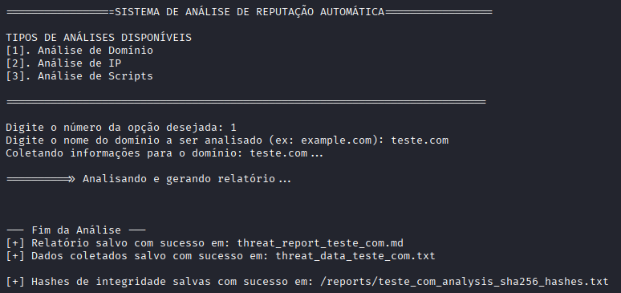

# Auto Reputation - Ferramenta de Análise de Reputação e Threat Intelligence com IA

## Introdução

Uma suíte de ferramentas de linha de comando em Python para realizar análises de reputação e threat intelligence em endereços IP, domínios e hashes de arquivos. O aplicativo coleta dados de diversas fontes públicas (**Abuse.ch**, **VirusTotal**, **AlienVault OTX**, **Urlscan**, **WHOIS**, etc.) e utiliza um modelo de linguagem grande (LLM) `gpt-oss:120b-cloud` através do `Ollama` para gerar relatórios detalhados em formato Markdown com geração de arquivos com dados coletados em `json` estruturado, que foram utilizados para a análise.

## Funcionalidades

- **Análise de Reputação de IP:** Coleta informações sobre portas abertas, serviços, geolocalização, vulnerabilidades (CVEs), arquivos associados e reputação em listas de ameaças.
- **Análise de Reputação de Domínio:** Coleta informações de WHOIS, subdomínios, arquivos e IPs associados e reputação em listas de ameaças.
- **Coleta e Análise de scripts de Sites Maliciosos**: Coleta de scripts executaod ao acessar o site, e posterior análise de compostamentos maliciosos observados nos scripts coletados.
- **Geração de Relatórios com IA:** Utiliza o modelo `gpt-oss:120b-cloud` via Ollama para analisar os dados coletados e gerar um relatório de threat intelligence estruturado.
- **Geração de Arquivo com Dados Coletados para Análise**: Gera arquivo em formato `.json`, de todos dados coletados e utilizados para a análise na geração do relatório.
- **Geração de Hash SHA256:** gera de forma automática hashes de integridade dos documentos criados e analisados.

## Tecnologias Utilizadas

- **Linguagem:** Python 3
- **Bibliotecas Python:**
  - `ollama`: Para integração com o modelo de linguagem local.
  - `requests`: Para realizar as requisições HTTP às APIs.
  - `python-dotenv`: Para gerenciamento de chaves de API e variáveis de ambiente.
  - `dnspython`: Para consultas DNS na enumeração de subdomínios.
  - `hashlib`: Geração de hash SHA256 dos documentos criados e analisados.
- **Inteligência Artificial:**
  - **Ollama**: Plataforma para execução de modelos de linguagem localmente.
  - **Modelo**: `gpt-oss:120b-cloud`.
- **Fontes de Dados e APIs Externas:**
  - Shodan
  - VirusTotal
  - AlienVault OTX
  - IPInfo.io
  - `whois` 
  - URLScan
  - AbuseIPDB
  - `wget`
  - `curl`
  - Scamalytics
  - Google Public DNS
  - DNS Dumpster
  - Phishing Army
  - VPNAPI
  - Abuse.ch
  - Hybrid Analysis
  - Netlas
  - URLhaus
  - Malware Bazaar
  - YARAify

## Pré-requisitos

Antes de começar, certifique-se de ter o seguinte instalado:

1.  **Python 3.8+**: Download Python
2.  **Ollama**: É necessário ter o Ollama instalado e em execução para a geração dos relatórios.
    - [Download Ollama](https://ollama.com/download) 
3.  **Modelo de IA**: O modelo utilizado nos scripts é o `gpt-oss:120b-cloud`. Baixe-o com o comando:
    ```bash
    ollama pull gpt-oss:120b-cloud
    ```
4. **whois**: É necessário ter a ferramenta pré instalada no sistema.
  * **Linux-Debian**: ``sudo apt install whois``
  * **Linux-Fedora**: ``sudo yum install whois``
  * **Windows**: [Download Whois](https://learn.microsoft.com/pt-br/sysinternals/downloads/whois) - Descomprimir dentro do ``/Windows/System32`` ou adiconar executáveis em ``PATCH``.

5. **wget**: É necessário ter a ferramenta pré instalada no sistema.
  * **Linux-Debian**: ``sudo apt install wget``
  * **Linux-Fedora**: ``sudo yum install wget``
   * **Windows**: [Download de binário do GNU wget para Windows](https://eternallybored.org/misc/wget/) - Mover para ``/Windows/System32`` ou adiconar executável em ``PATCH``.

## Instalação

1.  **Clone o repositório:**
    ```bash
    git clone https://github.com/pcanossa/Auto_Reputation.git
    cd Auto_Reputation
    ```

2.  **Crie e ative um ambiente virtual (recomendado):**
    ```bash
    python -m venv venv

    # Windows
    .\venv\Scripts\activate

    # Linux / macOS
    source venv/bin/activate
    ```

 3. **Instale o Ollama**:
    - Faça o download e instale o Ollama.
    - Iniciar o servidor ollama
      ```bash
       ollama serve
      ```
    - Baixe um modelo de linguagem robusto. O modelo `gpt-oss:120b-cloud` foi usado no desenvolvimento, mas outros modelos grandes também podem funcionar.
      ```bash
      ollama pull gpt-oss:120b-cloud
      ```
    - Autenticar dispositivo para uso da conta cloud. Será exibido uma url para autenticação. **(Necessário somente na primeira vez que executar o script)**
      ```bash
      ollama signin
      ```
    

    **Certifique-se de que o serviço do Ollama esteja em execução antes de rodar o script.**

## Configuração

A ferramenta requer chaves de API para consultar os serviços do VirusTotal, AlienVault OTX e AbuseIPDB.

1.  Navegue até o diretório `tools`:
    ```bash
    cd tools
    ```

2.  Crie um arquivo chamado `.env` neste diretório.

3.  Adicione suas chaves de API ao arquivo `.env` da seguinte forma:
    ```env
    VT_API_KEY=SUA_CHAVE_API_DO_VIRUSTOTAL
    ALIEN_VAULT_API_KEY=SUA_CHAVE_API_DO_ALIENVAULT
    ABUSEIPDB_API_KEY=SUA_CHAVE_API_DO_ABUSEIPDB
    SCAMNALYTICS_API_KEY=SUA_CHAVE_API_DO_SCAMNALYTICS
    DNS_DUMPSTER_API_KEY=SUA_CHAVE_API_DO_DNSDUMPSTER
    NETLAS_API_KEY=SUA_CHAVE_API_DO_NETLAS
    IPINFO_API_KEY=SUA_CHAVE_API_DO_IPINFO 
    ABUSE_CH_API_KEY=SUA_CHAVE_API_DO_ABUSE_CH 
    HYBRID_ANALYSIS_API_KEY=SUA_CHAVE_API_DO_HYBRID_ANALYSIS 
    ```

Acesso para obtenção das chaves API, após criação de consta (Todos possuem cota para usp gratuito):
* [Shodan](https://www.shodan.io/)
* [VirusTotal](https://www.virustotal.com/gui/join-us)
* [AlienVault OTX](https://otx.alienvault.com/)
* [AbuseIPDB](https://abuseipdb.com/)
* [Scamalytics](https://scamalytics.com/)
* [DNS Dumpster](https://dnsdumpster.com/)
* [Netlas](https://netlas.io/)
* [IPInfo](https://ipinfo.io/)
* [Abuse.ch](https://auth.abuse.ch/)
* [Hybrid Analysis](https://hybrid-analysis.com/)

## Como Usar



### Análise Principal (IP e Domínio)

O script principal `auto_reputation.py` oferece um menu interativo para escolher o tipo de análise.

1.  Execute o script
    ```bash
    python auto_reputation.py
    ```

2.  Siga as instruções no terminal para escolher entre a análise de Domínio (opção 1), IP (opção 2), scripts js (opção 3) ou análise de hash de arquivo (opção 4).

3.  Insira o alvo (domínio, IP ou Hash de arquivo) quando solicitado. 

4.  Aguarde a coleta de dados e a geração do relatório. Ao final, um arquivo `.md` com o relatório completo, e um arquivo `.json` com os dados coletados, utilizados na análise pela IA, serão salvo no diretório `reports`.

* **Certifique-se de sempre iniciar o serviço Ollama antes de executar o script com `ollama start`.**

## Estrutura do Repositório

-   `auto_reputation.py`: Ponto de entrada principal da aplicação. Apresenta o menu e chama os módulos de análise.
-   `/tools`
    -   `/analysis`
      -   `ip_analysis.py`: Módulo responsável por toda a lógica de coleta e análise de endereços IP.
      -   `domain_analysis.py`: Módulo responsável por toda a lógica de coleta e análise de domínios.
      -   `scripts_analisys.py`: Módulo responsável por toda a lógica de coleta e análise de scripts.
      -   `filehash_analisys.py`: Módulo responsável por toda a lógica de coleta e análise de hash de arquivo.
    -   `/others `
        -   `get_phishing_list.py`: Módulo responsável pela obtenção de lista de domínios reportados como phihshing.
        -   `ollama_engine.py`: Módulo responsável por toda a lógica de de comunicação e geração de resposta pela LLM / Ollama.
    -   `/prompts`: Diretório de prompts para geração de relatórios pela LLM.
        -   `domain_prompt`: Prompt utilizado para análise e geração de relatórios de domínios.
        -   `ip_prompt`: Prompt utilizado para análise e geração de relatórios de IPs.
        -   `filehash_prompt`: Prompt utilizado para análise e geração de relatórios de Hashes de Arquivos.     
-   `/reports`: Diretório de armazenamento dos relatórios gerados pelas análises.
    -   `/phishing_lists`: Diretório de armazenamento de listas de domínios reportados como phishing obtidas para análise.

## Aviso Legal

Esta ferramenta foi desenvolvida para fins educacionais e de análise de segurança. O uso indevido para atividades maliciosas é de total responsabilidade do usuário. Sempre utilize a ferramenta de forma ética e legal.
